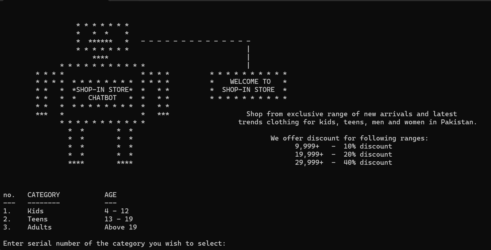

# 🛍️ Online Shopping Chatbot (C Language)

This is a simple console-based chatbot written in C that simulates an online shopping experience. It allows users to browse products, add items to a cart, view their total, and complete a checkout process — all through an interactive, menu-driven chat interface.

---

## 🧠 Features
- Text-based chatbot interface
- Product selection and categorization
- Cart management (add/remove items)
- Checkout with total price calculation
- **File generation** for user bill (receipt saved to a `.txt` file)
- Input validation and error handling

---

## 🛠️ Technologies Used
- Language: **C**
- Platform: Console (cross-platform)
- Concepts: Conditional logic, loops, functions, arrays, file I/O (`fopen`, `fprintf`, etc.)

---

## 📸 Screenshots

### 🧾 Chatbot Interface


---

## 🚀 How to Run
1. Clone the repo:
```bash
git clone https://github.com/yourusername/online-shopping-chatbot.git
cd online-shopping-chatbot
